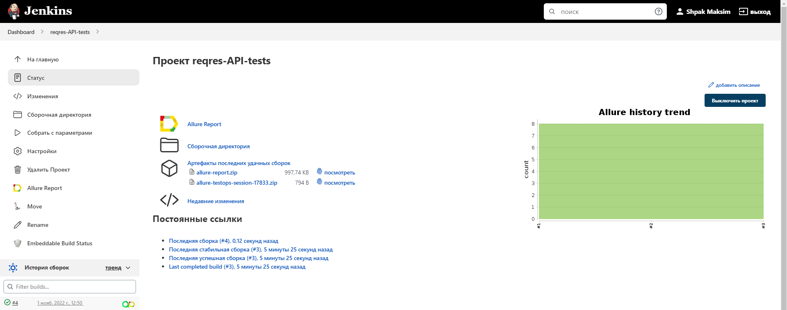
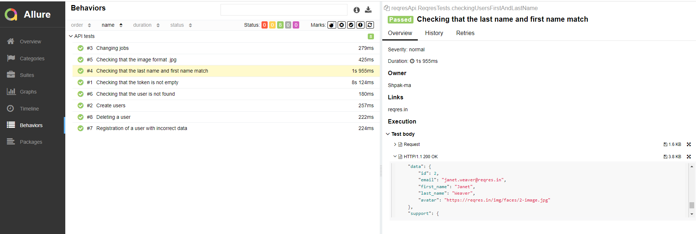
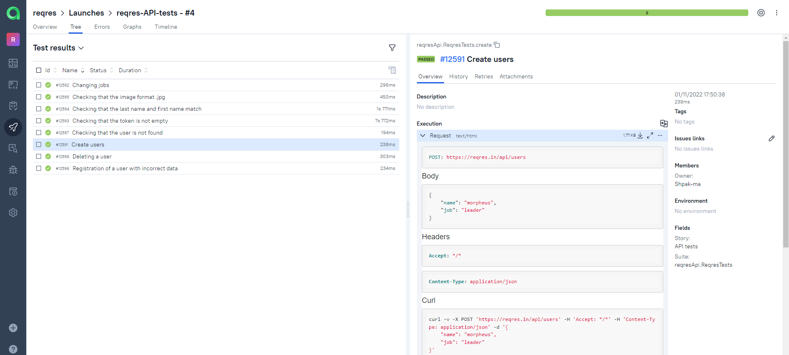
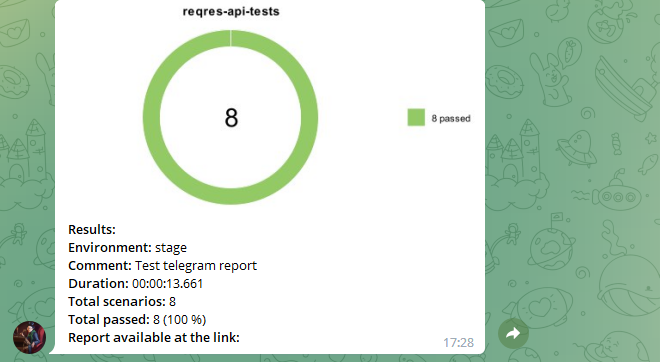

# Проект по автоматизации тестирования API на тестовом сайте reqres 

<a target="_blank" href="https://reqres.in/">Веб сайт reqres.in</a>

## :memo: Содержание:

- [Реализованные проверки](#boom-Реализованные-проверки)
- [Технологии](#classical_building-Технологии)
- [Сборка в Jenkins](#man_cook-Сборка-в-Jenkins)
- [Allure отчет](#bar_chart-Allure-отчет)
- [Интеграция с Allure TestOps](#И-Интеграция-с-Allure-TestOps)
- [Уведомление в Telegram при помощи бота](#-Уведомление-в-Telegram-при-помощи-бота)

## :boom: Реализованные проверки

- ✓ Создание пользователя
- ✓ Изменение данных пользователя
- ✓ Удаление пользователя
- ✓ Проверка соответствия формата изображений
- ✓ Проверка запрошенных данных о пользователе
- ✓ Проверка ответа 404 на запрос о несуществующем пользователе
- ✓ Наличие токена зарегистрированного пользователя

## :classical_building: Технологии

## :man_cook: Сборка в Jenkins
</a>  <a target="_blank" href="https://jenkins.autotests.cloud/job/reqres-API-tests/">Jenkins job</a>

## :bar_chart: Allure-отчет
</a> Отчет в <a target="_blank" href="https://jenkins.autotests.cloud/job/reqres-API-tests/4/allure/#">Allure report</a>

## </a> Интеграция с <a target="_blank" href="https://allure.autotests.cloud/launch/16339">Allure TestOps</a>

## </a> Уведомление в Telegram при помощи бота

